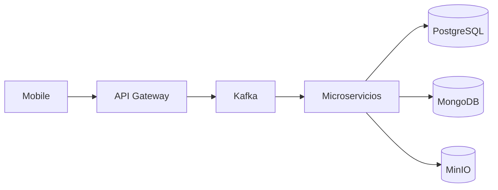

# Kairós Tech

**Equipo académico de UTEC · Uruguay 🇺🇾**

Somos un equipo de la **Licenciatura en Tecnologías de la Información de UTEC**. Construimos **Curupí**, una plataforma académica/experimental para digitalizar y trazabilizar el ciclo de comprobantes y documentos: desde la captura en mobile hasta la validación, firma, auditoría y almacenamiento.

## 🌿 ¿Qué problema resuelve Curupí?

Curupí busca reducir tareas manuales y errores en procesos administrativos con múltiples sistemas y formatos de comprobantes.

Capacidades principales:

- **Mobile (`curupi-mobile`)** para captura y seguimiento de operaciones.
- **Gateway (`python-api-gateway`)** como borde HTTP público y orquestación inicial.
- **Identidad (`python-identity`)** para autenticación/autorización e integración institucional.
- **Comprobantes y OCR (`python-invoice-extractor`, `python-invoices`, `python-cfe`)** para extracción, análisis y resolución.
- **Archivos (`python-file-service`)** para gestión de binarios.
- **Firma (`python-signature`)** para flujos de firma electrónica.
- **Auditoría (`python-audit-service`)** para trazabilidad funcional y de seguridad.
- **Infraestructura y datos (`kt-curupi-infra`, `kt-curupi-database-core`, `python-syncdb`)** para operación y proyecciones.

## 🏗️ Arquitectura (visión rápida)

### Principios de arquitectura

- **Gateway como borde público**: los servicios de negocio internos no exponen API pública directa.
- **Kafka + Protobuf para integración interna**: contratos versionados y comunicación orientada a eventos.
- **PostgreSQL como fuente transaccional** de verdad.
- **MongoDB como read model** para consultas y proyecciones.
- **MinIO para binarios** (archivos/documentos).
- **Infisical para gestión de secretos** y configuración sensible.
- **Servicios internos** orientados a casos de uso, desacoplados del canal público.

## 🚀 Por dónde empezar

### 1) Entrada funcional

- [API Gateway (`python-api-gateway`)](../python-api-gateway)
- [App Mobile (`curupi-mobile`)](../curupi-mobile)
- [Identidad (`python-identity`)](../python-identity)

### 2) Flujo de comprobantes

- [Extractor OCR (`python-invoice-extractor`)](../python-invoice-extractor)
- [Servicio de comprobantes (`python-invoices`)](../python-invoices)
- [Integración CFE/FEU (`python-cfe`)](../python-cfe)

### 3) Soporte transversal

- [File Service (`python-file-service`)](../python-file-service)
- [Firma (`python-signature`)](../python-signature)
- [Auditoría (`python-audit-service`)](../python-audit-service)
- [Sync relacional→read model (`python-syncdb`)](../python-syncdb)
- [Commons y contratos (`kt-curupi-commons`)](../kt-curupi-commons)
- [Migraciones/core de base (`kt-curupi-database-core`)](../kt-curupi-database-core)
- [Infraestructura local (`kt-curupi-infra`)](../kt-curupi-infra)

### 4) Productividad y calidad

- [Automatización QA (`curupi-qa-automation`)](../curupi-qa-automation)
- [Plantilla base Python (`python-template`)](../python-template)
- [Cliente API para pruebas (`curupi-api-client`)](../curupi-api-client)

## 📌 Estado del proyecto

Curupí está en **desarrollo académico/experimental**. Algunas integraciones y validaciones dependen de ambientes externos o credenciales institucionales (por ejemplo **ANEP/CAS**, **FEU**, **DGI** y **Firma.gub.uy**), por lo que la disponibilidad de ciertos flujos puede variar según el entorno.

---

  <strong>Kairós Tech 🇺🇾</strong> 
  Ingeniería de software · Sistemas distribuidos · Mobile · IA aplicada

